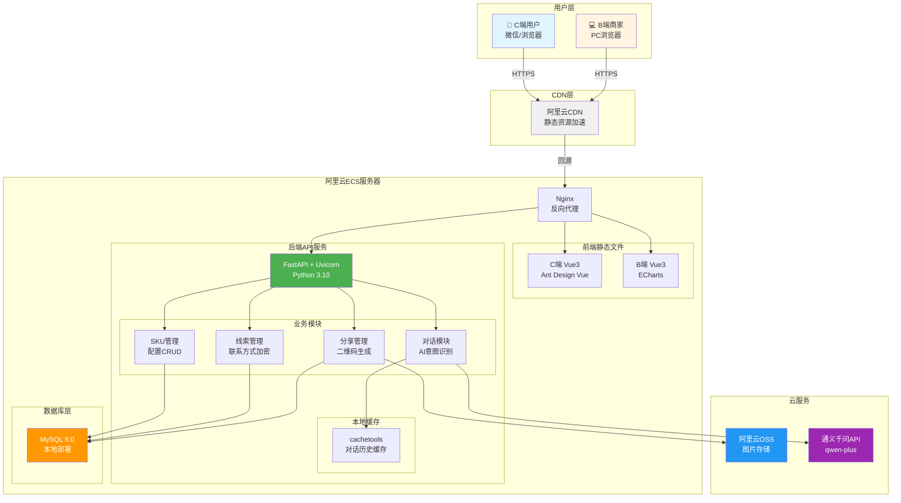
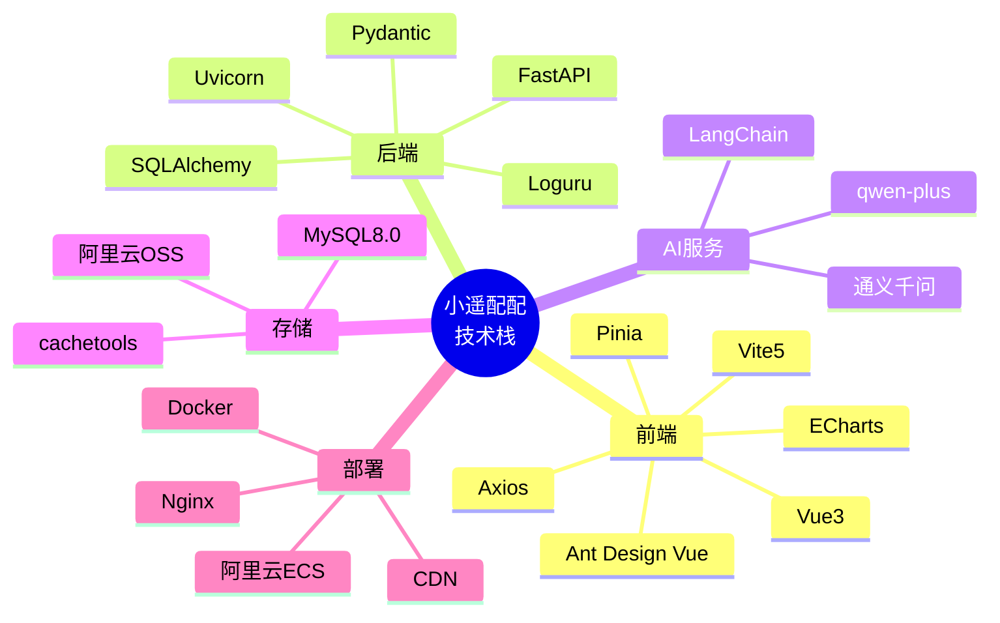
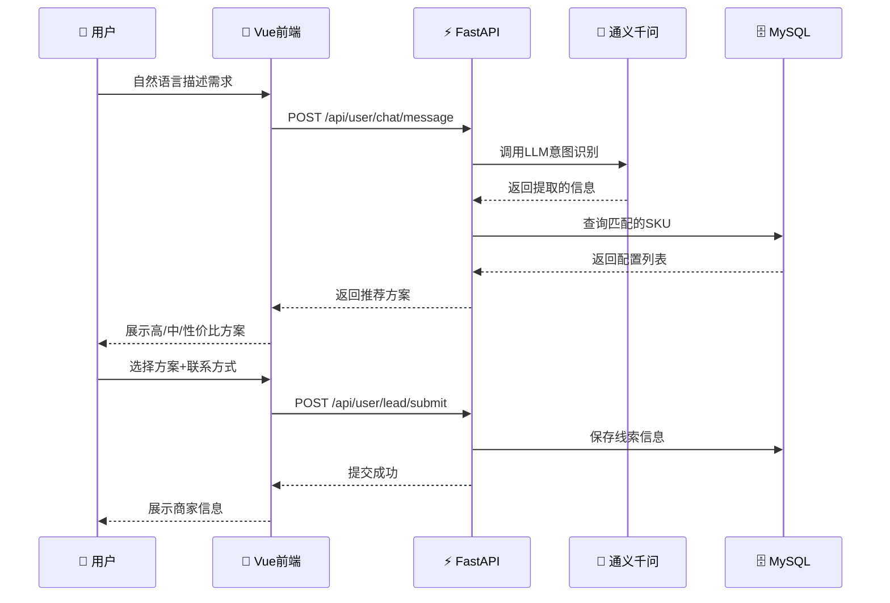

# 小遥配配 - 技术架构图

## 系统架构图

## 技术栈全景图

## 数据流图

## 前端技术选型

| 技术 | 版本 | 用途 |
|------|------|------|
| Vue | 3.4 | 核心框架 |
| Vite | 5 | 构建工具 |
| Ant Design Vue | 4.x | UI组件库 |
| Pinia | 2.x | 状态管理 |
| ECharts | 5 | 数据可视化(B端) |
| Axios | - | HTTP客户端 |

## 后端技术选型

| 技术 | 版本 | 用途 |
|------|------|------|
| Python | 3.10 | 开发语言 |
| FastAPI | 0.109 | Web框架 |
| Uvicorn | - | ASGI服务器 |
| SQLAlchemy | 2.0 | ORM框架 |
| Pydantic | 2.x | 数据验证 |
| Loguru | 0.7 | 日志管理 |
| Supervisor | - | 进程管理 |

## AI技术选型

| 技术 | 用途 |
|------|------|
| LangChain 0.1 | AI智能体框架 |
| 通义千问 qwen-plus | 大语言模型 |
| 成本 | 0.004元/1000 tokens |

## 存储与部署

| 组件 | 方案 | 成本 |
|------|------|------|
| 云服务器 | 阿里云ECS 2核4G | ~200元/月 |
| 数据库 | MySQL 8.0 本地部署 | 免费 |
| 文件存储 | 阿里云OSS | 免费(10GB额度) |
| CDN | 阿里云CDN | ~10元/月 |
| 域名 | .com | ~6元/月 |
